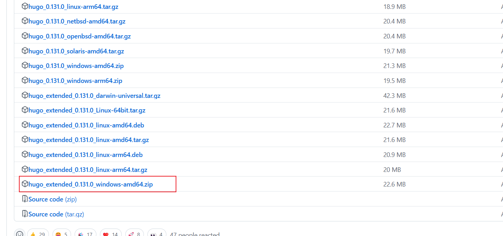
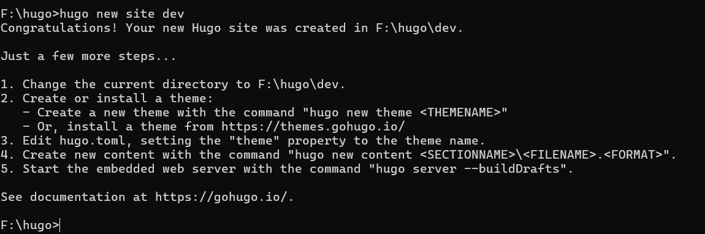

+++
title = 'Hugo+github博客搭建'
date = 2025-04-27T15:58:34+08:00
draft = true

+++

## hego+github实现个人博客部署

**参考B站博主Letere-莱特雷**

### 环境准备

[Release v0.131.0 · gohugoio/hugo](https://github.com/gohugoio/hugo/releases/tag/v0.131.0)



 **从hugo目录进入cmd并创建一个dev文件夹**

```
hugo new site dev
```



可参考：


```
cd dev
```

**由于没有配置全局，所以将hugo.exe复制到dev文件夹内**


### 挑选主题

https://themes.gohugo.io

#### 选择合适的


#### 选择版本：


#### 下载源码：


#### 解压到对应的目录下：


### 文件配置

#### 在解压后的文件中进行以下操作


#### 将以下两个文件复制到dev目录下并删除hugo.toml


#### 删掉以下文件


#### 修改文件名将版本号删掉


#### 启动测试一下

```
hugo server -D 
```


### 文件介绍

文章存放在post目录下


**例：**


注意文章的语言编码：


#### 编写文章

```
hugo new content post/First-test/index.md
```

重新启动一下

```
hugo server -D 
```


### 主题配置

**hugo.yaml里面更改**，`注意baseurl: https://fei-001.github.com/ReadBook这个地址的要求https://github名字.GitHub.com.io/仓库名字`


## 实现GitHub自动部署

### 先删掉public重新生成


```
hugo -D
```

### 将public里面的文件复制到本地的GitHub仓库并上传


稍等一会然后刷新页面


出现这个就成功了


